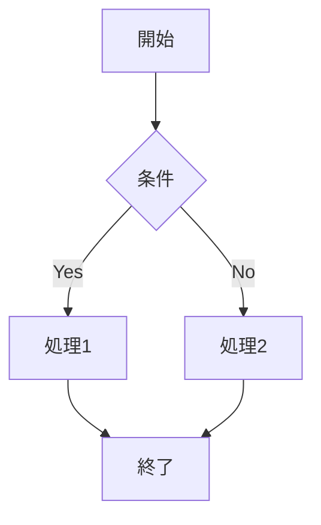
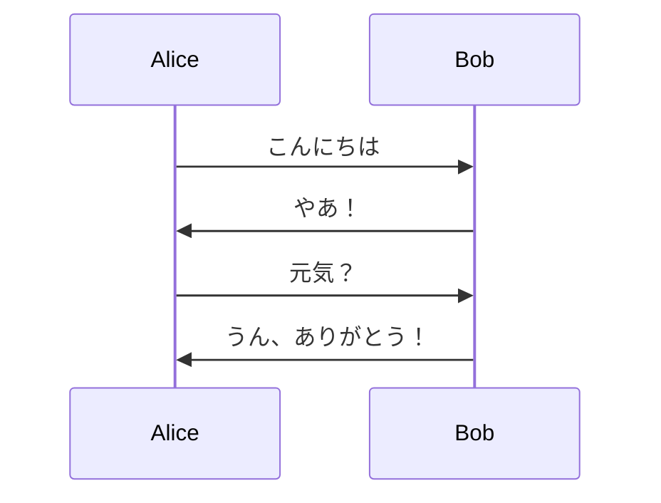
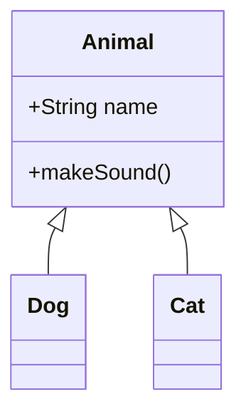
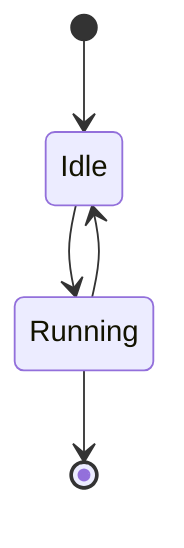
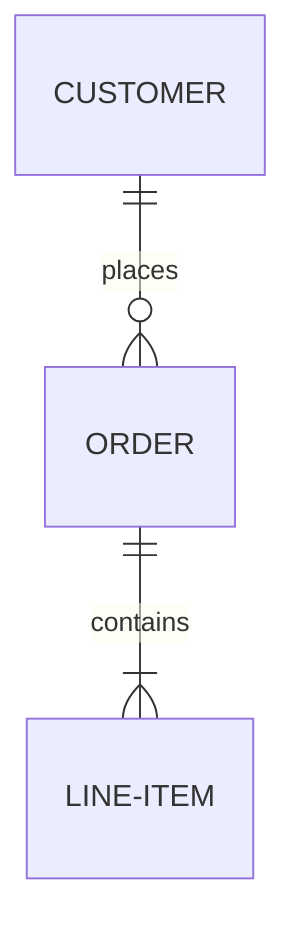
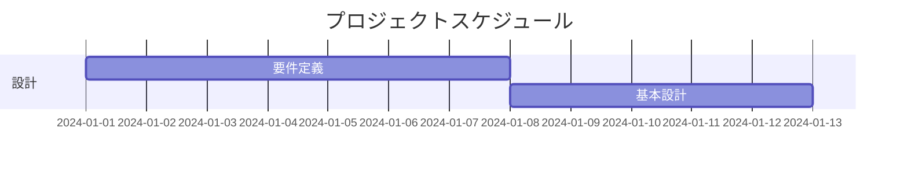
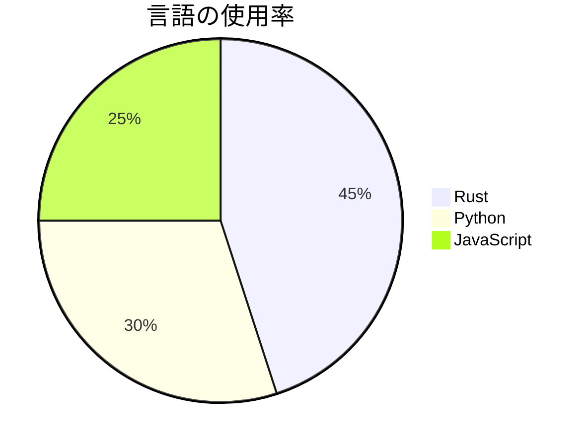

# CLI使い方ガイド

LalaエディタのCLI（コマンドラインインターフェース）モードの完全ガイドです。

## 目次

- [基本的な使い方](#基本的な使い方)
- [コマンド一覧](#コマンド一覧)
- [Markdownプレビュー](#markdownプレビュー)
- [HTMLプレビュー](#htmlプレビュー)
- [Mermaidダイアグラムプレビュー](#mermaidダイアグラムプレビュー)
- [LaTeXプレビュー](#latexプレビュー)
- [オプション](#オプション)
- [実践例](#実践例)
- [Tips & Tricks](#tips--tricks)

## 基本的な使い方

### ヘルプの表示

```bash
# 全般的なヘルプ
lala --help

# 特定のサブコマンドのヘルプ
lala preview --help
lala html --help
```

### バージョン確認

```bash
lala --version
```

## コマンド一覧

| コマンド | 説明 | 例 |
|---------|------|-----|
| `lala [FILE]` | GUIモードで起動 | `lala document.txt` |
| `lala preview FILE` | Markdownをプレビュー | `lala preview README.md` |
| `lala html FILE` | HTMLをプレビュー | `lala html index.html` |
| `lala mermaid FILE` | Mermaidダイアグラムをプレビュー | `lala mermaid diagram.mmd` |
| `lala latex FILE` | LaTeXドキュメントをプレビュー | `lala latex paper.tex` |

## Markdownプレビュー

### 基本的な使い方

```bash
lala preview document.md
```

### サポートされている要素

#### 見出し

```markdown
# 見出し1
## 見出し2
### 見出し3
```

ターミナルでは色分けされて表示されます：
- H1: 太字 + 青
- H2: 太字 + 緑
- H3: 太字 + シアン

#### リスト

```markdown
# 箇条書きリスト
- アイテム1
- アイテム2
  - サブアイテム

# 番号付きリスト
1. 最初
2. 次
3. 最後
```

#### コードブロック

````markdown
```rust
fn main() {
    println!("Hello, World!");
}
```
````

シンタックスハイライトは適用されませんが、コードブロックとして明確に区別されます。

#### リンク

```markdown
[Lalaエディタ](https://github.com/yourusername/lala)
```

#### 強調

```markdown
**太字**
*斜体*
~~取り消し線~~
`インラインコード`
```

#### 引用

```markdown
> これは引用です。
> 複数行にわたることもできます。
```

#### テーブル

```markdown
| 列1 | 列2 | 列3 |
|-----|-----|-----|
| A   | B   | C   |
| 1   | 2   | 3   |
```

### オプション

```bash
# カラー出力を無効化
lala preview --no-color document.md

# 標準入力から読み込み
cat document.md | lala preview -
```

### 実践例

```bash
# READMEのプレビュー
lala preview README.md

# 変更を監視しながらプレビュー（別のターミナルで）
watch -n 1 "lala preview --no-color document.md"

# マークダウンファイルを探してプレビュー
find . -name "*.md" -exec lala preview {} \;
```

## HTMLプレビュー

### 基本的な使い方

```bash
lala html index.html
```

### サポートされている要素

- 見出し（H1-H6）
- 段落
- リスト（順序付き・順序なし）
- テーブル
- リンク
- コードブロック
- 強調テキスト

### HTMLの変換

HTMLは内部で以下のように変換されます：

```html
<h1>タイトル</h1>
<p>これは段落です。</p>
<ul>
  <li>アイテム1</li>
  <li>アイテム2</li>
</ul>
```

↓ ターミナル出力

```
タイトル
========

これは段落です。

• アイテム1
• アイテム2
```

### 実践例

```bash
# Webページのプレビュー
lala html page.html

# ダウンロードしたHTMLのプレビュー
curl -s https://example.com | lala html -

# 複数のHTMLファイルを順番にプレビュー
for file in *.html; do
    echo "=== $file ==="
    lala html "$file"
done
```

## Mermaidダイアグラムプレビュー

### 基本的な使い方

```bash
lala mermaid diagram.mmd
```

### サポートされているダイアグラムタイプ

#### 1. フローチャート



```bash
lala mermaid flowchart.mmd
```

#### 2. シーケンス図



```bash
lala mermaid sequence.mmd
```

#### 3. クラス図



```bash
lala mermaid class.mmd
```

#### 4. 状態図



```bash
lala mermaid state.mmd
```

#### 5. ER図



```bash
lala mermaid er.mmd
```

#### 6. ガントチャート



```bash
lala mermaid gantt.mmd
```

#### 7. 円グラフ



```bash
lala mermaid pie.mmd
```

### ASCIIアート出力

Mermaidダイアグラムはターミナルに適したASCIIアートに変換されます：

```
┌─────────┐
│  開始   │
└────┬────┘
     │
     ▼
   ┌───┐
   │条件│
   └─┬─┘
     │
  Yes│  No
     │   │
```

### 実践例

```bash
# プロジェクト内の全Mermaidファイルをプレビュー
find docs/ -name "*.mmd" -exec lala mermaid {} \;

# パイプラインで使用
cat architecture.mmd | lala mermaid -

# ドキュメント生成と組み合わせ
lala mermaid diagram.mmd > output.txt
```

## LaTeXプレビュー

### 基本的な使い方

```bash
lala latex document.tex
```

### サポートされている要素

#### 1. ギリシャ文字

```latex
\alpha, \beta, \gamma, \delta
\Alpha, \Beta, \Gamma, \Delta
```

ターミナル出力：
```
α, β, γ, δ
Α, Β, Γ, Δ
```

#### 2. 数学演算子

```latex
\sqrt{x}, \int, \sum, \prod
\partial, \nabla, \infty
```

ターミナル出力：
```
√(x), ∫, ∑, ∏
∂, ∇, ∞
```

#### 3. 分数

```latex
\frac{a}{b}
\frac{numerator}{denominator}
```

ターミナル出力：
```
a/b
numerator/denominator
```

#### 4. 添字

```latex
x^2, x_i, x^{2n}
a_1, a_2, a_n
```

ターミナル出力：
```
x², xᵢ, x²ⁿ
a₁, a₂, aₙ
```

#### 5. 数式環境

```latex
\begin{equation}
E = mc^2
\end{equation}

\begin{align}
x &= 1 \\
y &= 2
\end{align}
```

#### 6. リストと構造

```latex
\begin{itemize}
\item 項目1
\item 項目2
\end{itemize}

\begin{enumerate}
\item 最初
\item 次
\end{enumerate}
```

### 実践例

```bash
# 論文のプレビュー
lala latex paper.tex

# 数式のみのファイル
lala latex equations.tex

# 複数のTeXファイルを処理
for tex in *.tex; do
    echo "=== $tex ==="
    lala latex "$tex"
done
```

## オプション

### グローバルオプション

| オプション | 説明 | 例 |
|-----------|------|-----|
| `--help` | ヘルプを表示 | `lala --help` |
| `--version` | バージョンを表示 | `lala --version` |

### プレビューオプション

| オプション | 説明 | 対象コマンド | 例 |
|-----------|------|-------------|-----|
| `--no-color` | カラー出力を無効化 | 全プレビューコマンド | `lala preview --no-color file.md` |
| `-` | 標準入力から読み込み | 全プレビューコマンド | `cat file.md \| lala preview -` |

## 実践例

### 1. ドキュメント作成ワークフロー

```bash
# エディタで編集
vim document.md

# プレビュー
lala preview document.md

# 満足したらGitにコミット
git add document.md
git commit -m "Update documentation"
```

### 2. 複数ファイルの一括プレビュー

```bash
# 全Markdownファイルを順番に表示
for md in *.md; do
    clear
    echo "=== Previewing: $md ==="
    lala preview "$md"
    read -p "Press Enter to continue..."
done
```

### 3. ファイル監視とプレビュー

```bash
# inotify-toolsを使用（Linux）
while inotifywait -e modify document.md; do
    clear
    lala preview document.md
done

# fswatch を使用（macOS）
fswatch -o document.md | xargs -n1 -I{} sh -c 'clear && lala preview document.md'
```

### 4. パイプラインでの使用

```bash
# curlと組み合わせ
curl -s https://raw.githubusercontent.com/user/repo/main/README.md | lala preview -

# grepと組み合わせ
cat large-file.md | grep -A 10 "Section" | lala preview -

# sedと組み合わせ
sed 's/old/new/g' template.md | lala preview -
```

### 5. バッチ処理

```bash
#!/bin/bash
# すべてのMermaidダイアグラムをテキストに変換

mkdir -p output

for mmd in diagrams/*.mmd; do
    basename=$(basename "$mmd" .mmd)
    lala mermaid "$mmd" --no-color > "output/${basename}.txt"
    echo "Converted: $mmd -> output/${basename}.txt"
done
```

### 6. エイリアスの設定

`~/.bashrc` または `~/.zshrc` に追加：

```bash
# Markdownプレビューのショートカット
alias mdp='lala preview'
alias mdpnc='lala preview --no-color'

# HTMLプレビュー
alias htmlp='lala html'

# Mermaidプレビュー
alias mmd='lala mermaid'

# LaTeXプレビュー
alias texp='lala latex'
```

使用例：
```bash
mdp README.md
htmlp index.html
mmd diagram.mmd
```

## Tips & Tricks

### 1. ページャーと組み合わせ

長いファイルの場合、ページャーと組み合わせると便利です：

```bash
lala preview long-document.md | less -R
lala html large-page.html | more
```

`-R` オプションでカラーコードを保持します。

### 2. 出力のリダイレクト

```bash
# ファイルに保存
lala preview --no-color document.md > output.txt

# 別のコマンドにパイプ
lala preview README.md | grep "Installation"
```

### 3. カラースキームのカスタマイズ

環境変数で端末のカラースキームを調整：

```bash
# 暗い背景用
export LALA_THEME=dark

# 明るい背景用
export LALA_THEME=light
```

（注：この機能は将来のバージョンで実装予定）

### 4. スクリプトでの使用

```bash
#!/bin/bash
# ドキュメント検証スクリプト

docs=(
    "README.md"
    "INSTALL.md"
    "USAGE.md"
)

for doc in "${docs[@]}"; do
    if lala preview "$doc" > /dev/null 2>&1; then
        echo "✓ $doc is valid"
    else
        echo "✗ $doc has errors"
    fi
done
```

### 5. Gitフックとの統合

`.git/hooks/pre-commit`:

```bash
#!/bin/bash
# コミット前にMarkdownファイルをチェック

changed_md=$(git diff --cached --name-only --diff-filter=ACM | grep '\.md$')

if [ -n "$changed_md" ]; then
    echo "Validating Markdown files..."
    for file in $changed_md; do
        if ! lala preview "$file" > /dev/null 2>&1; then
            echo "Error in $file"
            exit 1
        fi
    done
    echo "All Markdown files are valid"
fi
```

### 6. tmuxでの分割表示

```bash
# 左側でエディタ、右側でプレビュー
tmux split-window -h "watch -n 1 'lala preview document.md'"
```

## トラブルシューティング

### カラーが表示されない

```bash
# 環境変数を確認
echo $TERM

# カラーが有効かテスト
lala preview test.md
```

解決方法：
```bash
export TERM=xterm-256color
```

### ファイルが見つからない

```bash
# 相対パスではなく絶対パスを使用
lala preview /full/path/to/document.md

# 現在のディレクトリを確認
pwd
ls -la
```

### 標準入力が機能しない

```bash
# ハイフンを明示的に使用
cat file.md | lala preview -

# ファイル記述子を使用
lala preview /dev/stdin < file.md
```

---

その他の質問や問題は [Issue](https://github.com/yourusername/lala/issues) で報告してください。
