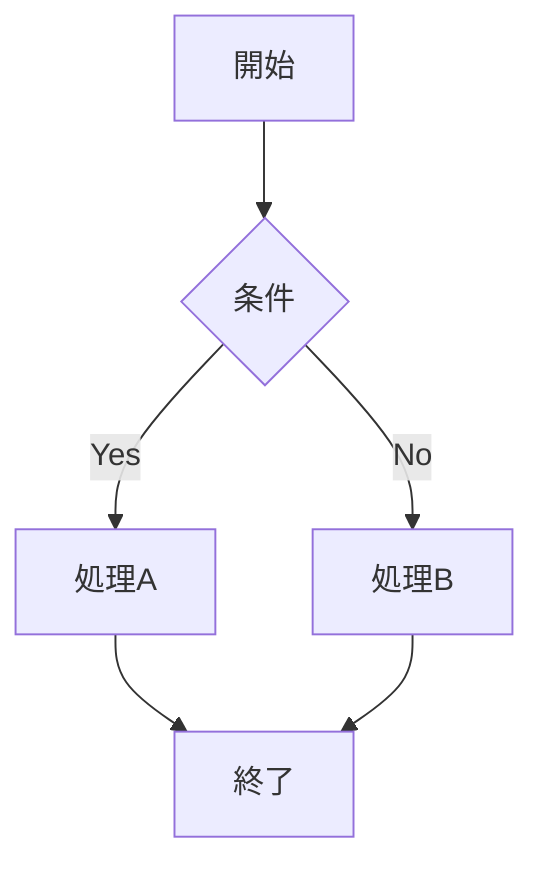
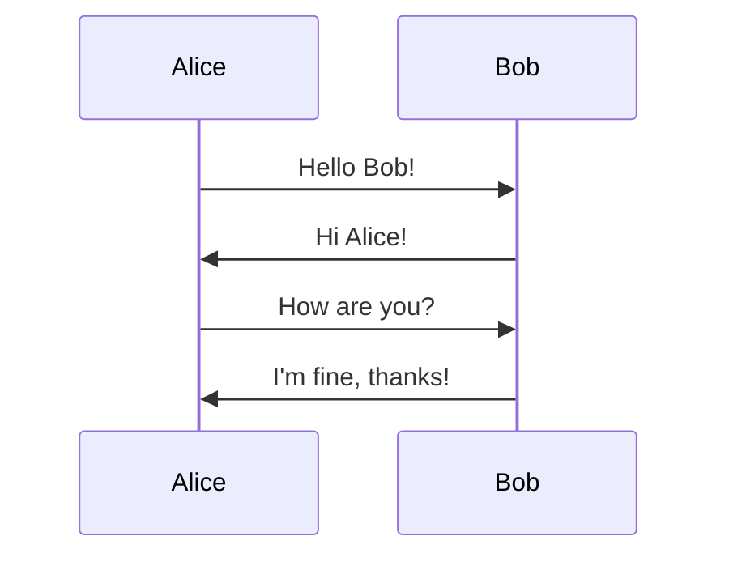
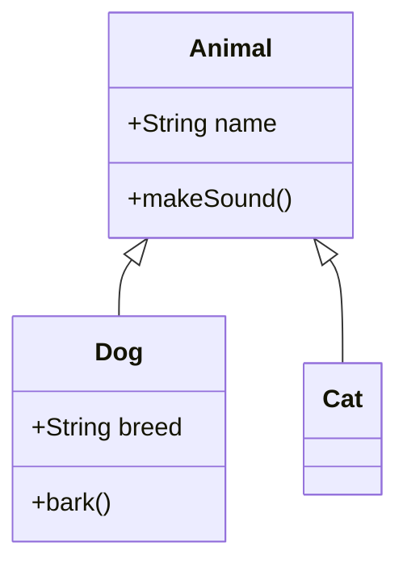
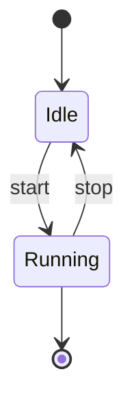
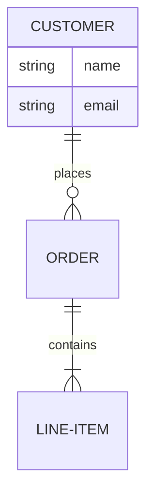
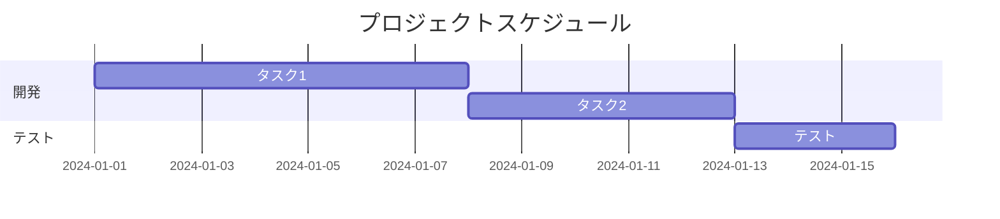
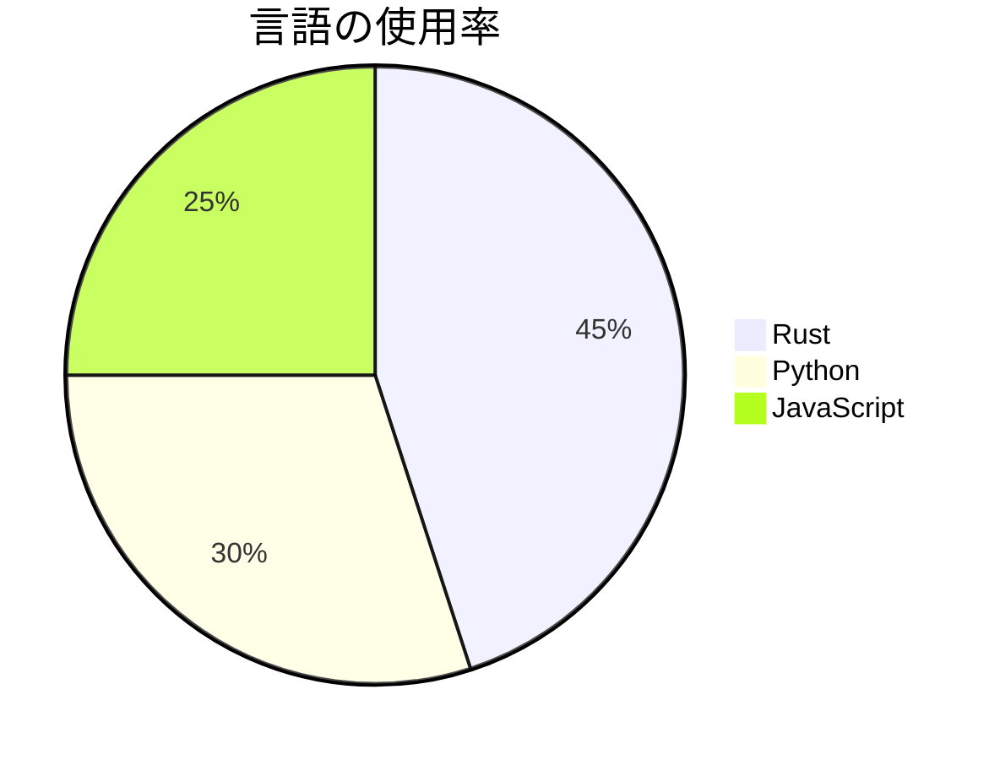

# フォーマット対応ガイド

Lalaエディタがサポートする各フォーマットの詳細な説明とレンダリング方法を解説します。

## 目次

- [概要](#概要)
- [Markdown](#markdown)
- [HTML](#html)
- [Mermaid](#mermaid)
- [LaTeX](#latex)
- [レンダリングアーキテクチャ](#レンダリングアーキテクチャ)
- [制限事項](#制限事項)
- [今後の対応予定](#今後の対応予定)

## 概要

Lalaエディタは以下の4つの主要なドキュメントフォーマットに対応しています：

| フォーマット | 用途 | 出力形式 | WebView依存 |
|------------|-----|---------|-----------|
| Markdown | ドキュメント、README | カラーテキスト | なし |
| HTML | Webページ、レポート | プレーンテキスト | なし |
| Mermaid | ダイアグラム、図表 | ASCIIアート | なし |
| LaTeX | 数式、論文 | Unicodeシンボル | なし |

すべてのフォーマットは**純粋なターミナル出力**として表示され、WebViewやグラフィカルな依存関係を必要としません。

## Markdown

### 対応要素

#### 見出し（H1-H6）

```markdown
# 見出しレベル1
## 見出しレベル2
### 見出しレベル3
#### 見出しレベル4
##### 見出しレベル5
###### 見出しレベル6
```

**レンダリング方法**:
- H1: 太字 + 青色 + 下線
- H2: 太字 + 緑色
- H3: 太字 + シアン色
- H4-H6: 太字

#### 段落

```markdown
これは通常の段落です。
複数行にわたって記述できます。

段落は空行で区切られます。
```

**レンダリング方法**: プレーンテキストとして出力、適切な行間を保持

#### リスト

**順序なしリスト**:
```markdown
- 項目1
- 項目2
  - ネストされた項目
  - もう1つ
- 項目3

* アスタリスクも使える
+ プラス記号も使える
```

**順序付きリスト**:
```markdown
1. 最初の項目
2. 2番目の項目
   1. ネストされた項目
   2. もう1つ
3. 3番目の項目
```

**レンダリング方法**:
- 箇条書き: `•` (bullet point)
- 番号付き: `1.`, `2.` など
- インデントで階層を表現

#### コードブロック

**フェンスコードブロック**:
````markdown
```rust
fn main() {
    println!("Hello, World!");
}
```

```python
def hello():
    print("Hello, World!")
```
````

**インデントコードブロック**:
```markdown
    // インデントでもコードブロックになる
    let x = 42;
```

**レンダリング方法**:
- 枠で囲んで表示
- 言語名を表示（指定されている場合）
- モノスペースフォントで表示

#### インラインコード

```markdown
`let x = 42;` のようにバッククォートで囲む
```

**レンダリング方法**: 黄色でハイライト

#### 強調

```markdown
**太字**
*斜体*
***太字斜体***
~~取り消し線~~
```

**レンダリング方法**:
- `**太字**`: 太字
- `*斜体*`: 斜体（対応している端末のみ）
- `~~取り消し線~~`: 取り消し線

#### リンク

```markdown
[リンクテキスト](https://example.com)
[リンクテキスト](https://example.com "タイトル")
```

**レンダリング方法**:
- リンクテキストを青色で表示
- URLを括弧内に表示
- 例: `リンクテキスト (https://example.com)`

#### 画像

```markdown


```

**レンダリング方法**:
- 代替テキストのみ表示
- 形式: `[Image: 代替テキスト]`

#### 引用

```markdown
> これは引用です。
> 複数行にわたることもできます。
>
> > ネストした引用も可能
```

**レンダリング方法**:
- `│` 記号で引用を視覚化
- インデントで階層を表現

#### テーブル

```markdown
| ヘッダー1 | ヘッダー2 | ヘッダー3 |
|---------|---------|---------|
| セル1   | セル2   | セル3   |
| セル4   | セル5   | セル6   |

| 左揃え | 中央揃え | 右揃え |
|:-------|:--------:|-------:|
| 左     | 中央     | 右     |
```

**レンダリング方法**:
- 罫線文字（`─`, `│`, `┌`, `┐` など）で表を描画
- アライメントを保持

#### 水平線

```markdown
---
***
___
```

**レンダリング方法**: `─` 記号の連続で水平線を描画

### 実装詳細

**使用ライブラリ**: [pulldown-cmark](https://github.com/raphlinus/pulldown-cmark)

**レンダリングフロー**:
1. Markdownをパース
2. イベントストリームを生成
3. ターミナル用にフォーマット
4. ANSIカラーコードを適用

## HTML

### 対応要素

#### 見出し（H1-H6）

```html
<h1>最上位見出し</h1>
<h2>セカンドレベル見出し</h2>
<h3>サードレベル見出し</h3>
```

**レンダリング方法**:
- Markdownの見出しと同様のカラースキーム
- 階層構造を保持

#### 段落と改行

```html
<p>これは段落です。</p>
<p>別の段落です。</p>
<br>
```

**レンダリング方法**:
- 段落間に適切な空白を挿入
- `<br>`は改行として処理

#### リスト

```html
<ul>
  <li>項目1</li>
  <li>項目2</li>
</ul>

<ol>
  <li>最初</li>
  <li>次</li>
</ol>
```

**レンダリング方法**:
- `<ul>`: `•` マーカー
- `<ol>`: 数字マーカー
- ネストをインデントで表現

#### テーブル

```html
<table>
  <thead>
    <tr>
      <th>列1</th>
      <th>列2</th>
    </tr>
  </thead>
  <tbody>
    <tr>
      <td>データ1</td>
      <td>データ2</td>
    </tr>
  </tbody>
</table>
```

**レンダリング方法**:
- 罫線文字でテーブルを描画
- ヘッダーを強調表示

#### リンク

```html
<a href="https://example.com">リンク</a>
```

**レンダリング方法**: `リンク (https://example.com)`

#### コード

```html
<code>インラインコード</code>
<pre><code>コードブロック</code></pre>
```

**レンダリング方法**:
- インラインコードは黄色でハイライト
- コードブロックは枠で囲む

#### 強調

```html
<strong>太字</strong>
<em>斜体</em>
<b>太字</b>
<i>斜体</i>
```

**レンダリング方法**:
- `<strong>`, `<b>`: 太字
- `<em>`, `<i>`: 斜体

### 実装詳細

**使用ライブラリ**:
- [html2text](https://github.com/jugglerchris/rust-html2text) - HTML→テキスト変換
- [scraper](https://github.com/causal-agent/scraper) - HTMLパース

**レンダリングフロー**:
1. HTMLをDOMとしてパース
2. 要素ごとにテキストを抽出
3. フォーマット情報を保持
4. ターミナル用に整形

## Mermaid

### 対応ダイアグラムタイプ

#### 1. フローチャート (Graph/Flowchart)



**レンダリング方法**:
```
┌─────────┐
│  開始   │
└────┬────┘
     │
     ▼
  ┌──────┐
  │ 条件 │
  └──┬───┘
   Yes│No
     │  │
     ▼  ▼
 ┌────┐┌────┐
 │処理A││処理B│
 └──┬─┘└──┬─┘
    │     │
    └──┬──┘
       ▼
   ┌──────┐
   │ 終了 │
   └──────┘
```

**サポート機能**:
- ノードの形状（長方形、菱形、円形など）
- エッジのラベル
- 方向（TD, LR, BT, RL）

#### 2. シーケンス図



**レンダリング方法**:
```
 Alice                Bob
   │                   │
   │   Hello Bob!      │
   │──────────────────>│
   │                   │
   │   Hi Alice!       │
   │<──────────────────│
   │                   │
   │   How are you?    │
   │──────────────────>│
   │                   │
   │ I'm fine, thanks! │
   │<──────────────────│
   │                   │
```

**サポート機能**:
- メッセージの矢印（同期・非同期）
- アクティベーション
- ノート

#### 3. クラス図



**レンダリング方法**:
```
┌─────────────┐
│   Animal    │
├─────────────┤
│ +name       │
├─────────────┤
│ +makeSound()│
└──────┬──────┘
       │
   ┌───┴───┐
   │       │
   ▼       ▼
┌────┐  ┌────┐
│Dog │  │Cat │
└────┘  └────┘
```

**サポート機能**:
- 継承関係
- メンバー変数とメソッド
- アクセス修飾子

#### 4. 状態図



**レンダリング方法**:
```
  (start)
     │
     ▼
  ┌──────┐
  │ Idle │
  └───┬──┘
      │ start
      ▼
  ┌─────────┐
  │ Running │
  └────┬────┘
       │ stop
       ▼
    (end)
```

#### 5. ER図



**レンダリング方法**:
```
┌──────────┐       ┌───────┐
│ CUSTOMER │       │ ORDER │
├──────────┤       ├───────┤
│ name     │       │       │
│ email    │       │       │
└────┬─────┘       └───┬───┘
     │ places          │
     │ 1      ∞        │
     └────────┬────────┘
              │ contains
              ▼
        ┌───────────┐
        │ LINE-ITEM │
        └───────────┘
```

**サポート機能**:
- エンティティと属性
- リレーションシップ
- カーディナリティ

#### 6. ガントチャート



**レンダリング方法**:
```
プロジェクトスケジュール
2024-01-01    2024-01-15
│             │
開発:
  タスク1 ████████
  タスク2         ██████
テスト:
  テスト                 ████
```

#### 7. 円グラフ



**レンダリング方法**:
```
言語の使用率
─────────────
Rust        : 45% ███████████████
Python      : 30% ██████████
JavaScript  : 25% ████████
```

### 実装詳細

**カスタムパーサー**: Mermaid構文を独自にパース

**レンダリングフロー**:
1. Mermaid構文を解析
2. ダイアグラムタイプを検出
3. ASCIIアートとして生成
4. ボックス描画文字を使用（`─`, `│`, `┌`, `┐`, など）

**制限事項**:
- 複雑なレイアウトは簡略化される
- 一部の高度な機能は未サポート

## LaTeX

### 対応要素

#### ギリシャ文字

**小文字**:
```latex
\alpha, \beta, \gamma, \delta, \epsilon, \zeta, \eta, \theta
\iota, \kappa, \lambda, \mu, \nu, \xi, \omicron, \pi
\rho, \sigma, \tau, \upsilon, \phi, \chi, \psi, \omega
```

**レンダリング**: α, β, γ, δ, ε, ζ, η, θ, ι, κ, λ, μ, ν, ξ, ο, π, ρ, σ, τ, υ, φ, χ, ψ, ω

**大文字**:
```latex
\Alpha, \Beta, \Gamma, \Delta, \Theta, \Lambda, \Xi, \Pi
\Sigma, \Upsilon, \Phi, \Psi, \Omega
```

**レンダリング**: Α, Β, Γ, Δ, Θ, Λ, Ξ, Π, Σ, Υ, Φ, Ψ, Ω

#### 数学演算子

```latex
\sqrt{x}    % 平方根
\int        % 積分
\sum        % 総和
\prod       % 総積
\partial    % 偏微分
\nabla      % ナブラ
\infty      % 無限大
\pm         % プラスマイナス
\times      % 乗算
\div        % 除算
\leq        % 以下
\geq        % 以上
\neq        % 不等号
\approx     % 近似
```

**レンダリング**: √, ∫, ∑, ∏, ∂, ∇, ∞, ±, ×, ÷, ≤, ≥, ≠, ≈

#### 分数

```latex
\frac{numerator}{denominator}
\frac{a+b}{c+d}
```

**レンダリング方法**:
- インライン: `a/b`
- 複雑な場合: 垂直表現で近似

#### 添字

**上付き**:
```latex
x^2
x^{2n}
e^{i\pi}
```

**レンダリング**: x², x²ⁿ, eⁱᵖⁱ

**下付き**:
```latex
x_1
x_i
a_{n+1}
```

**レンダリング**: x₁, xᵢ, aₙ₊₁

#### 数式環境

```latex
\begin{equation}
E = mc^2
\end{equation}

\begin{align}
x &= a + b \\
y &= c + d
\end{align}

\begin{matrix}
a & b \\
c & d
\end{matrix}
```

**レンダリング方法**:
- 数式番号は表示しない
- アライメントを可能な限り保持
- マトリックスは角括弧で表現

#### 関数

```latex
\sin x
\cos x
\tan x
\log x
\ln x
\exp x
\lim_{x \to \infty}
```

**レンダリング**: sin x, cos x, tan x, log x, ln x, exp x, lim(x→∞)

### 実装詳細

**カスタムパーサー**: LaTeXコマンドをUnicodeに変換

**変換テーブル**:
- 300以上のLaTeXコマンド
- Unicode数学記号へのマッピング
- 複雑な構造の簡略化

**レンダリングフロー**:
1. LaTeXコマンドを検出
2. 変換テーブルを参照
3. Unicode記号に置換
4. 構造を保持しながらフォーマット

**制限事項**:
- 複雑な数式は簡略化される
- 一部の高度なパッケージは未サポート
- グラフィックスは非対応

## レンダリングアーキテクチャ

### アーキテクチャ概要

```
┌────────────┐
│ ユーザー入力 │
└──────┬─────┘
       │
       ▼
┌─────────────┐
│  ファイル読込  │
└──────┬──────┘
       │
       ▼
┌─────────────┐
│フォーマット検出│
└──────┬──────┘
       │
   ┌───┴───┐
   │       │
   ▼       ▼
Markdown  HTML  Mermaid  LaTeX
   │       │      │       │
   ▼       ▼      ▼       ▼
┌────────────────────────┐
│    レンダリングエンジン    │
└──────────┬─────────────┘
           │
           ▼
    ┌─────────────┐
    │ ANSI出力生成 │
    └──────┬──────┘
           │
           ▼
    ┌──────────┐
    │ ターミナル │
    └──────────┘
```

### モジュール構成

```rust
src/cli/
├── mod.rs                 // CLIメインロジック
├── markdown_view.rs       // Markdownレンダラー
├── html_view.rs          // HTMLレンダラー
├── mermaid_view.rs       // Mermaidレンダラー
└── latex_view.rs         // LaTeXレンダラー
```

各レンダラーは以下のインターフェースを実装：

```rust
pub fn render_to_terminal(content: &str) {
    // フォーマット固有のレンダリングロジック
}

pub fn render_plain(content: &str) {
    // カラーなしのレンダリング
}
```

## 制限事項

### 共通の制限

1. **ターミナルサイズ**: ターミナルの幅に合わせて表示
2. **カラー対応**: ANSI対応ターミナルが必要
3. **フォント**: Unicodeをサポートするフォントが必要

### Markdown

- シンタックスハイライト: コードの色分けはなし
- 画像: 表示不可、代替テキストのみ
- 数式: 基本的なものは表示可能

### HTML

- CSS: スタイルは無視
- JavaScript: 実行不可
- 画像/メディア: 表示不可

### Mermaid

- レイアウト: 簡略化される
- スタイリング: 基本的なもののみ
- アニメーション: 非対応

### LaTeX

- パッケージ: 基本的なもののみ
- グラフィックス: TikZなど非対応
- 複雑な数式: 簡略化される

## 今後の対応予定

### 短期（v0.2.0）

- [ ] Markdown: シンタックスハイライト
- [ ] HTML: より多くのタグ対応
- [ ] Mermaid: レイアウトの改善
- [ ] LaTeX: より多くの記号対応

### 中期（v0.3.0）

- [ ] AsciiDoc対応
- [ ] reStructuredText対応
- [ ] Org-mode対応
- [ ] 画像のASCIIアート変換

### 長期（v1.0.0）

- [ ] カスタムレンダラープラグイン
- [ ] 出力フォーマットのカスタマイズ
- [ ] インタラクティブプレビュー
- [ ] リアルタイム更新

## フィードバック

フォーマット対応に関する要望や問題は [Issue](https://github.com/yourusername/lala/issues) で報告してください。

新しいフォーマットの対応リクエストも歓迎します！
